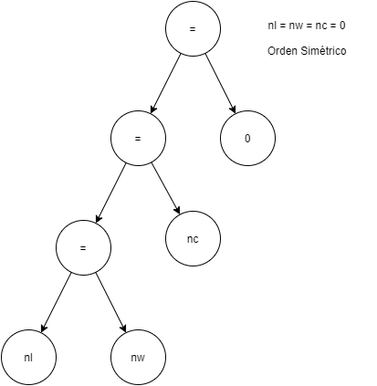
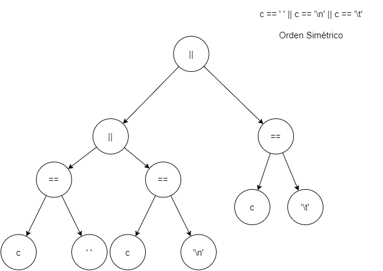
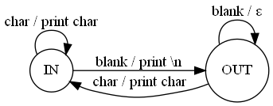

## 1 - Árboles

### 1

    b) Dibujar el árbol de expresión para la inicialización de los contadores: nl = nw = nc = 0.

    c)  Dibujar el árbol de expresión para la expresión de control del segundo if: c == ' ' || c == '\n' || c == '\t'.

### 2 - Máquinas de estado

    a)Describir en lenguaje dot [DOT2015] y dentro del archivo wl.gv la
    máquina de estado que resuelve el problema planteado

    b)Formalizar la máquina de estados como una n-upla, basarse en el Capítulo #1 del Volumen #3 de [MUCH2012].

    Tenemos una 5-upla, A=(Q, Σ, δ, A, F), donde:
    Q = { IN, OUT }, conjunto de posibles estados,
    Σ = {'a',...,'z','A',...,'Z',' ','\n','\t','\0','.',',',':',';'} alfabeto que comprende,
    δ = Conjunto de funciones de transición, de tipo Q x Σ => Q, determinando un estado y un caracter leído, pasamos a un estado.

|     | a...z,A...Z | ' ',\t,\n,\o... |
| --- | ----------- | --------------- |
| IN  | IN          | OUT             |
| OUT | IN          |                 |

    A = Acciones que puede realizar. Recibe una terna (EstadoInicial, Transicion, EstadoFinal) y devulelve una acción. En este caso las acciones son imprimir el caracter leído o un '\n'.

| Terna de Salida          | Acción      |
| ------------------------ | ----------- |
| (IN; a...z, A...Z; IN)   | putchar(c)  |
| (IN; ' ', \t,\n...; OUT) | putchar(\n) |
| (OUT; a...z, A....Z; IN) | putchar(c)  |

    I = OUT, Estado inicial.

### 3 - Implementaciones

    a.ii)
    Como ventajas, ambos facilitan mucho la lectura del programa, siendo IN/OUT mucho más expresivo que 1/0. Facilita también a la hora de realizar cambios al programa, ya que solo debemos cambiar la declaración del define o del enum, en lugar de buscar cada ocurrencia de los estados.

    Usar una constate simbólica trae la desventaja de no poder definir un tipo, no hay restricciones para, por ejemplo, hacer una comparación con sentido semántico pero no pragmático (IN < 8 por ejemplo).

    Algunas desventajas del enum es que no podemos definir estados con algunos tipos de datos como char, por ejemplo.

    b.ii)
    Si es utiliza a conciencia, el goto puede reducir la complejidad algorítmica. Un ejemplo clásico es salir de varios ciclos anidados si se encuentra un error en la ejecución. También, si es crucial la performance a nivel muy bajo, puede resultar útil. Go, C# poseen la instrucción.

    c.ii)
    En este caso no son necesarios, pero si quiesiera usarlos se me ocurren dos formas. Uno sería tilizar una variable global que guarde el valor del contador. El otro sería que la función recursiva reciba como argumento el contador, y con cada llamada recursiva este se incremente.
